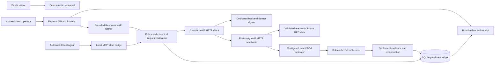
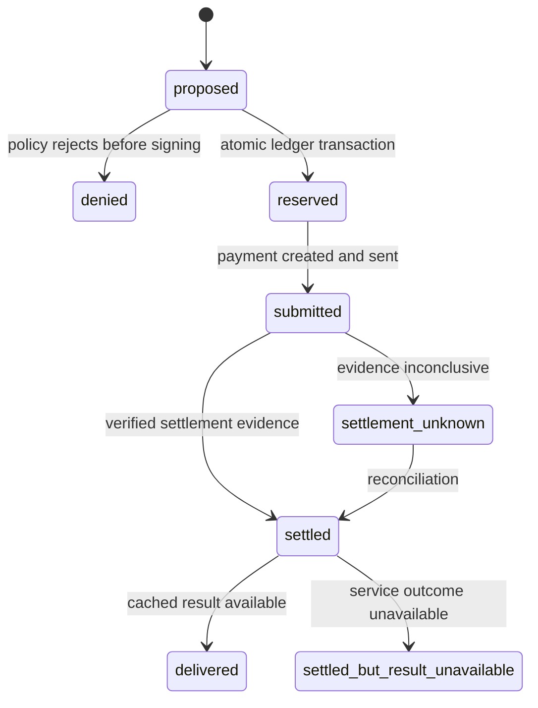

# Allowance architecture

Allowance is a single-operator developer application with a server-managed devnet signer and application-enforced spending limits. Its two sample merchants are first-party services. The model proposes purchases; the server owns authorization, the catalog, recipients, network, mint, signing, and the durable ledger. A compromised server can compromise these controls. There is no smart-wallet or onchain budget guarantee.

## Boundaries

| Component         | Responsibility                                                                                                            |
| ----------------- | ------------------------------------------------------------------------------------------------------------------------- |
| React/Vite UI     | Public rehearsal, operator configuration, run progress, report, JSON/print receipts                                       |
| `server/auth`     | Password verification, rotating sessions, persistent session state, authorization, CSRF/origin enforcement and throttling |
| `server/agent`    | One configured OpenAI Responses API model, narrow tool schemas, serial bounded calls, final grounded report               |
| `server/policy`   | Exact integer amounts, immutable policy, cap/expiry/allowlist checks and transactional reservation                        |
| `server/db`       | Durable run, reservation, request identity, event, payment and delivery state                                             |
| `server/payments` | Selected-requirement validation, pre-sign ledger guard, isolated signer, settlement checking and recovery                 |
| `server/mcp`      | Local stdio tools, hashed session-bound grants, fixed scopes and safe error mapping                                    |
| `server/merchant` | Actual HTTP x402 middleware, bounded validated inputs, purchased-result recovery                                          |
| `server/data`     | Bounded, schema-validated, lossless Solana JSON-RPC reads                                                                 |

The live runner must traverse the same HTTP merchant middleware as a separate client. The public `/demo` is fixture-only and invokes neither a model nor payment services. The conventional LLM-provider bill is separately capped and outside the USDC allowance.

The [Vercel rehearsal](vercel.md) is a static copy of the public interface. Its build does not mount operator/private route components and emits no backend functions. API and merchant paths return 404, and browser connections are blocked by its Content Security Policy. This public deployment does not change the live application's one-instance, persistent-disk requirements or host its ledger.

## Durable purchase lifecycle

`settled + held <= authorized` is enforced with integer micro-units and transactional uniqueness. An unresolved submission stays held and blocks new payer spending. An idempotency ID alone never grants purchased-data access. Stop and expiry prevent new signatures; they cannot undo a submitted transaction. A restart resumes observation/reconciliation of the same authorization, never renews expired permission.

The example uses 40000 authorized micro-USDC, purchases of 10000 and 20000, and a separate 20000 policy probe rejected with 10000 left. The probe is visibly distinct from model behavior. A different valid live model trace is retained as observed.

## Data contract and limitations

Wallet snapshots fetch a confirmed SOL balance and at most eight signatures, with slot, per-signature block time and observation time. Empty history is a valid result; RPC errors are explicit failures. Balance/history are separate reads, so the result is not an atomic snapshot.

Transaction explanations request `jsonParsed`, confirmed commitment and `maxSupportedTransactionVersion: 0`. The service decodes plain System Program transfers and SPL `transfer`/`transferChecked`, preserves unsupported markers, and reports native/token net balance changes. Memo strings and unknown instructions are data, never instructions for the agent. Failed transaction instructions are attempted actions; fees can still apply. No entity identity, token value, economic intent or investment advice is inferred.

Response bodies are capped at 512 KiB, calls time out after 10 seconds by default, arrays have explicit bounds, and no automatic RPC retries occur. `lossless-json` preserves u64 values before Zod validates them. Decimal outputs use integer/string formatting. HTTPS endpoints are server configuration, redirects are refused, and endpoint credentials are not surfaced to the UI. Genesis verification rejects a mislabeled cluster and is cached for at most 60 seconds.

Payment network always remains devnet. Mainnet data requires both an explicit mainnet data setting and a separate read-only opt-in. UI labels must identify mode, data network and payment network independently.

Each purchase receipt separates facilitator settlement from independent chain proof. It records `chainVerified`, the original signed blockhash when known, the observation timestamp, delivery state, and a SHA-256 result hash after delivery. A provider validity height is recorded only when a provider supplies one; the application never fabricates it.

## Deployment

One persistent Node process serves Express, the compiled frontend and its bounded background runner. SQLite needs a persistent mounted disk and one application instance. Back up the database together with its WAL state using an SQLite-aware backup method. Do not deploy this backend as stateless Vercel serverless functions. A separately hosted frontend rehearsal is a different deployment choice.

Payment channels remain a later adapter. The current MCP bridge is local stdio only and uses the existing guard and ledger; it is not a public transport. See [payment-channels.md](payment-channels.md), [mcp.md](mcp.md), [live-setup.md](live-setup.md) and the repository verification report for demonstrated versus pending evidence.

## Runtime ownership and hard deadlines

A renewable SQLite service lease is acquired before startup recovery. Reservation and immediate pre-sign checks also verify current ownership, so a paused old process cannot resume signing after a replacement takes the lease. The lease coordinates one deployment instance; transactional reservations and unique payment identities remain the spending integrity boundary. Read-only preflight does not run startup recovery.

Each new run snapshots both the operator expiry and a three-minute runtime deadline. The pure evaluator and immediate signer boundary enforce those deadlines independently of JavaScript timer scheduling. The public fixture's separate probe uses the same pure evaluator with a deterministic fixture clock; it has no access to signer, database, or live runner modules.

Merchant replay proves the original signed payment, not fresh requester possession. It is used here for public Solana data. Private merchant results would require an additional session or separately protected recovery secret. Private operator reports always require the operator session.
